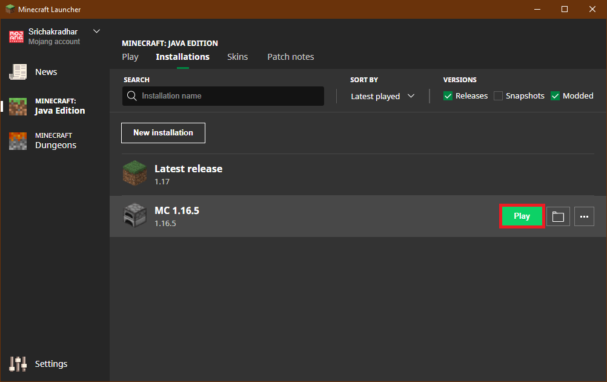

# Setup

## Download Minecraft

* [ ] [**Login**](https://www.minecraft.net/en-us) to your Minecraft account.

* [ ] Choose [**Microsoft Login**](https://login.live.com/oauth20_authorize.srf?redirect_uri=https%3a%2f%2fsisu.xboxlive.com%2fconnect%2foauth%2fXboxLive&response_type=code&state=LAAAAAEB12r9KBzTYYsg8DH2Sn9n-hSQEldFnEqsuCFsSgxeOgqWHlEQQlsfOThlNjVhNDE2NTY5NDk0Njk5MGE0ZDg3NjFiZTRhZmMx&client_id=000000004420578E&scope=XboxLive.Signin&lw=1&fl=dob,easi2&xsup=1&cobrandid=8058f65d-ce06-4c30-9559-473c9275a65d) \(Mojang Login is not available for new accounts since Dec 1, 2020\)

* [ ] Enter the email provided to you

* [ ] and password

* [ ] Click **DOWNLOAD** button

* [ ] Choose DOWNLOAD for your platform \(Windows / MacOS / Linux\)

* [ ] Open **MinecraftInstaller.msi**

* [ ] Run the installer \(MinecraftInstaller.msi\)

* After a brief preparation to install,

* [ ] you get a welcome wizard

* [ ] Choose destination folder

* [ ] Start installation

* Wait a bit, till Minecraft Launcher is installed \(usually a couple of minutes\)

* [ ] Installer finishes installation

* [ ] In a few seconds, Minecraft Launcher is opened for you. ****Click on Installations tab. \(Otherwise open it from desktop or start menu\)

* [ ] Let's choose a new installation \(our server runs 1.16.5\)

* [ ] Create new installation \(Choose 1.16.5\). Choose a name you like and click on **Create.** Leave other values with their defaults.

* [ ] Let's **Play** the new installation!

* Now, the magic is being prepared!

* Wait until the bar is filled with green.

* Wait for a few seconds and you'll see the game is loading

* [ ] Click on Multiplayer.

* [ ] Let's add the server \(You may have empty screen. That's OK\).

* Add server info. **Server Name**: UMKC LearnCraft **Server Address**: umkc.ddns.net

* [ ] Join Server and let the fun begin!

* Wait one final time before the grand reveal!

* Welcome to UMKC! \(in MineCraft\)

